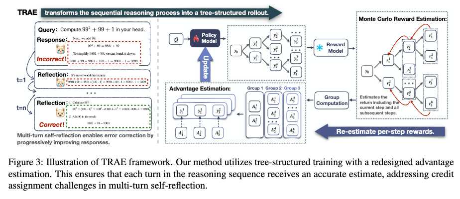

<h1 align="center" style="margin-top: 10px;">Tree Search for LLM Agent Reinforcement Learning</h1>

<p align="center">
  Linxuan Du*<sup>1</sup>,
  Guangquan Xue*<sup>1</sup>,
  Xiaobo Liang<sup>1</sup>,
  Qipeng Huang<sup>1</sup>,
  Yuyang Ding<sup>1</sup>,
  Xinyu Shi<sup>1</sup>,
  Yijun Zhang<sup>3</sup>,
  Ji Qi<sup>3</sup>,
  Wenpeng Zhu<sup>3</sup>,
  Juntao Li<sup>1</sup>,
  Min Zhang<sup>1,2</sup>,
  <br>
  <sup>1</sup>Soochow University <br>
  <sup>2</sup>Key Laboratory of General Artificial Intelligence and Large Models in Provincial Universities, Soochow University <br>
  <sup>3</sup>China Mobile (Suzhou) Software Technology Co., Ltd. Suzhou 215000, China
  <br>
</p>

<div align="center"> 

[]()
[]()

</div>

## Overview
To address behavior collapse in multi-turn reflec-
tion, we propose a method that assigns distinct
advantages to different turns within a trajectory,
enabling targeted optimization at the turn level, as
illustrated in Figure 3. Our approach consists of
three steps: (1) designing a more accurate turn-
level reward estimation for multi-turn reflection;
(2) obtaining this estimation via tree-structured roll-
outs; and (3) assigning turn-specific advantages
based on the rewards computed in the previous
steps

<p align="center">
  
  <i>
  The overview of TRAE training pipeline.
  </i>
</p>

## Links

- [Overview](#overview)
- [Links](#links)
- [Installation](#installation)
- [Training](#training)
- [Evaluation](#evaluation)
- [Acknowledgement](#acknowledgement)
- [Citations](#citations)

## Installation
```bash
### Create a new environment with python3.12
conda create -n trae python=3.12
conda activate trae

### Install Verl_0.7.0.dev0
cd verl
bash scripts/verl_install.sh
```

## Training

Train a multi-turn reflective LLM on our dataset using verl, based on Qwen3-8B-Base.

```bash
## The configuration is consistent with that used in the paper.
bash scripts/train/run_qwen3-8b-base_trae.sh
```

## Evaluation
(1) Prepare evaluation data

For each question-answer sample, it should be a dictionary containing the desired content as below:
```
dataset.append({
    "problem" : data["problem"],
    "answer" : data["answer"],
    "id" : data["id"]
})
```
Plase download the evaluation data by your own, and refer to the data prepocess code in ```evaluation/dataset_load_utils.py```

(2) Run Evaluation.
```bash
# merge model
bash scripts/verl_merge_fsdb_2.sh

# eval
bash scripts/eval.sh

# To see the evaluation result, modify the raw_path in analysis_tree.py.
python evaluation/analysis_tree.py
```
## Acknowledgement

The codebase is built upon [Deepseek-R1](https://github.com/deepseek-ai/DeepSeek-R1) and [veRL](https://github.com/volcengine/verl).We sincerely appreciate the efforts of these teams for their contributions to open-source research and development.

## Citations
```bibtex

```